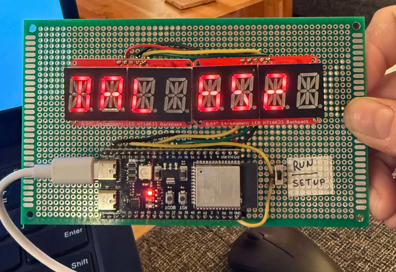
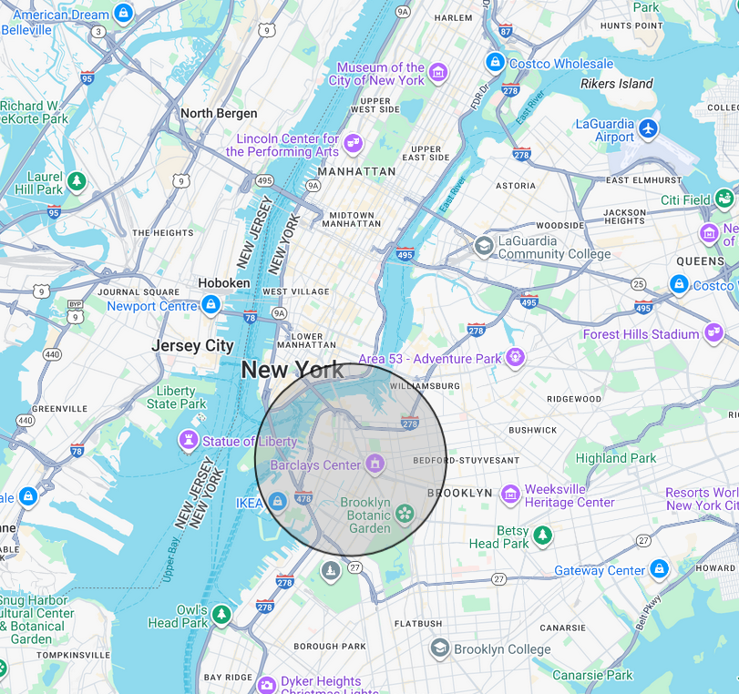

# F @ East Broadway  (+ planes)

I can't see the subway from my window, but I still want to know when to leave for
it. This device shows a live countdown to the next **F trains — both directions,
uptown and downtown** — at the **East Broadway** station on the Lower East Side,
on dual 14-segment LED displays.

And because the hardware started life as an LGA plane spotter: whenever there's an
airliner low over Brooklyn on final into **LaGuardia**, the plane takes over the
whole display — flight number, airline, origin airport, aircraft type — until it
passes. It also shows nearby **bus** countdowns and the current **NWS weather
alert** for the neighborhood, if there is one.



It's an ESP32-based device that pulls real-time arrival data from the MTA's
GTFS-realtime feed (via the [wheresthefuckingtrain.com](https://wheresthefuckingtrain.com/)
JSON proxy, so no protobuf parsing on the microcontroller) and cycles through
the minutes-to-arrival for the next few trains each way, plus plane data from
[adsb.lol](https://adsb.lol/) and weather alerts from
[api.weather.gov](https://www.weather.gov/documentation/services-web-api).

## Version
 - version 4.7
 - Sep 9, 2026

## Features

- **Next-train countdown, both directions in one list**: a single `E B'WAY`
  station frame, then the next few F trains **either way, sorted soonest-first**.
  Each frame is `nX YYmin` — `n` is the place in line, `X` is `U` (uptown) or
  `D` (downtown / Brooklyn): `1D  2min`, `2U  3min`, `3D  6min`, ... (`nX  NOW`
  when one's basically here, `NO F TRN` when nothing's running). Up to
  `NUM_TRAINS` per direction go into the merge.
- **Plane on approach (takes over the display)**: when an `A3` (large / airliner)
  aircraft is between `ADSB_ALT_MIN` and `ADSB_ALT_MAX` feet inside the bounding
  disc over Williamsburg, the display shows **only** the `*PLANE*` block —
  callsign (`AAL 1389`), airline, aircraft type (`Airbus A321`), altitude, and
  origin (`FROM MIA MIAMI`) — and skips trains, buses, and weather until it
  passes. Northern-most plane wins (closest to LGA). Everything keeps fetching in
  the background, so the trains/buses are current the moment the sky clears.
- **Buses**: one block per stop in the `BUS_FEEDS` table — by default the
  **M14A-SBS** at Grand St / Clinton St westbound → Abingdon Sq, and the **M9**
  at Essex St / East Broadway westbound → Battery Park City. Each shows its own
  header (`M14A BUS`, `M9 BUS`) then `1B  4min`, `2B 12min`, ... (the `B` matches
  the trains' `U`/`D`). MTA BusTime SIRI; each stop carries other routes too, so
  only the feed's `linePrefix` is kept. Needs an API key (see [Secrets](#secrets));
  no key → the whole bus section is skipped, and a stop with nothing tracked
  (e.g. the M9 overnight) just doesn't draw.
- **Weather alert**: if the NWS has any active watch/warning/advisory for the
  point, the event name (`Winter Weather Advisory`) scrolls across with the
  display **blinking** to catch the eye — the event only, no headline or
  instructions. Refreshed every 5 min; nothing shown when it's clear.
- **Fade + scroll transitions**: each frame dims, scrolls the old data out to
  the left while the new data scrolls in from the right, then fades back up to
  full brightness. Plane details scroll horizontally (they're longer than the
  8 columns).
- **Decoupled fetch**: each source (trains ~30s, adsb.lol ~20s, buses ~30s,
  weather ~5min) polls on its own clock and the display loops off the caches
  between fetches. A failed or empty fetch just leaves that block's last data (or
  nothing) — the other blocks are unaffected.
- **Fetch progress bar**: the HTTP calls block the loop, so while a fetch cycle
  runs the display becomes a dim left-to-right bar — one column per call. When a
  call starts, a `-` with its **decimal point lit** ("working"); when it returns
  the `-` morphs segment-by-segment into the result and the DP goes dark — `*`
  got data (the dash blooms into a star), `0` call OK but nothing there (a ring
  closes around the dash, then the dash dissolves), `X` error (the dash tips over
  into an X). The finished bar scrolls away as the real frames come back.
- **NTP time sync**: turns the feed's absolute arrival timestamps into a live
  countdown; falls back to the feed's own `updated` time if NTP doesn't sync.
- **Dual 14-Segment LED Displays**: shows scrolling text and data.
- **WiFi Connectivity**: connects to your WiFi network to fetch live arrival data.
- **Setup Mode**: built-in access point for easy WiFi configuration via web
  interface, selectable by switch.
- **Run Mode**: does its little thing.

### How the plane spotter picks a plane



Every `ADSB_REFETCH_MS` it asks [adsb.lol](https://adsb.lol/) for aircraft within
`ADSB_RADIUS_NM` nautical miles of `ADSB_LAT,ADSB_LON` — roughly the grey disc
above. adsb.lol has no free bounding-box query, and that disc reaches the Hudson
corridor west of Manhattan, so the results are then clipped to a lat/lon box
over Brooklyn (`BBOX_LAT_MIN/MAX`, `BBOX_LON_MIN/MAX` — Greenpoint down to
Green-Wood, the East River across to East New York). Of what's left in the box it
keeps only `A3` (airliner-sized) traffic between `ADSB_ALT_MIN` and
`ADSB_ALT_MAX` feet — jets actually on final, not high overflights or little
planes — and shows the one with the **highest latitude** (northern-most =
closest to touchdown at LGA, the plane icon above).

## Hardware

- [ESP32-S3 Wroom 1 Dev Board](https://docs.espressif.com/projects/esp-dev-kits/en/latest/esp32s3/esp32-s3-devkitc-1/index.html) (or compatible board)
- 2x [Adafruit 14-Segment LED Backpacks, Product ID: 2157](https://www.adafruit.com/product/2157) (I2C addresses 0x70 and 0x71)
- Physical [switch](https://www.nintendo.com/us/gaming-systems/switch-2/) connected to GPIO 13 (for mode selection)
- [USB cable](https://www.amazon.com/dp/B0DF1RRT3N) for power and programming
- 3D printed a case using this cool [OpenSCAD](https://openscad.org/) Ultimate [Box Maker](https://www.thingiverse.com/thing:1264391) on a [Prusa Mini+](https://www.prusa3d.com/category/original-prusa-mini/)

### Pins

- **I2C SDA**: GPIO 9
- **I2C SCL**: GPIO 18
- **Mode Switch**: GPIO 13 (INPUT_PULLUP)

## Software Setup

### Prerequisites

- [PlatformIO](https://platformio.org/) — either the VS Code extension or the
  [Core CLI](https://docs.platformio.org/en/latest/core/installation/index.html)
  (`pio`). Developed on Linux.
- USB drivers for ESP32 (usually automatic on Linux)

### Installation

If you're the type to do this, you probably don't need instructions, but...

1. Clone or download this project.
2. `cp include/secrets.h.example include/secrets.h` and paste in your keys
   (see [Secrets](#secrets)). Optional — it builds fine without it.
3. Connect the ESP32 board via USB (it enumerates as `/dev/ttyACM0` on Linux;
   adjust `upload_port` / `monitor_port` in `platformio.ini` otherwise).
4. Build and flash, either way:

**VS Code / PlatformIO IDE** — open the folder, then the PlatformIO toolbar
buttons: ✓ build, → upload. Environment `freenove_esp32_s3_wroom` is the default.

**Command line** — with the [PlatformIO Core CLI](https://docs.platformio.org/en/latest/core/installation/index.html)
(`pio`). The env name is `freenove_esp32_s3_wroom`:

```sh
pio run                                          # compile only
pio run -t upload                                # compile + flash to the board
pio run -t upload -t monitor                     # ...then open the serial monitor
pio device list                                  # find the port if it isn't /dev/ttyACM0
pio run -t clean                                 # wipe build artifacts
```

There's only one environment, so `-e freenove_esp32_s3_wroom` is optional; add it
if you define more. If `pio` isn't on your `PATH`, PlatformIO's installer puts it
at `~/.platformio/penv/bin/pio` (use that full path — a distro-packaged
`/usr/bin/pio` may not work). Serial output over USB doesn't show on Linux for
this board (see [Serial Monitor](#serial-monitor)).

### Secrets

API keys are compiled in from `include/secrets.h`, which is **gitignored** — it
never goes to GitHub. Copy the template and fill it in:

```
cp include/secrets.h.example include/secrets.h
```

| Key | Used for | Get one |
| --- | --- | --- |
| `BUSTIME_API_KEY` | MTA BusTime (the bus blocks) | <https://register.developer.obanyc.com/> |

`main.cpp` pulls the file in with `#if __has_include("secrets.h")` and defines
empty fallbacks, so a build with no `secrets.h` still works — the bus block just
stays dark.

### Dependencies

The project uses the following libraries (automatically installed via PlatformIO):
- Adafruit GFX Library
- Adafruit LED Backpack Library
- ArduinoJson

### Case

See links above for info, but you can just print the .STLs under case.  If you'd like to modify them, use OpenSCAD and there is a lovely configurator that the original author wrote!  


- 130mm wide
- 120mm deep
- 45mm tall

LED PCB hole is 12mm higher than the centerline of the LED display. Box is 45 high.  45/2= 22.5 - 12 = 10.5mm down from top

Back of the LED PCB needs to be 25mm behind the back of the plexiglass to accommodate for pins, connectors, and depth of LEDs.

screw holes on the 20mm x 80mm PCBs are 76mm apart

Screw mounts placed in tinkercad rather than OpenSCAD because I like to fiddle.

I cut a piece of red plexiglass to the size/shape of the end cap to be able to see the LED display through. 


More pictures coming

## Usage

### Initial Setup

1. With the mode switch in **SETUP** position (LOW), power on the device.
2. The device creates a WiFi access point named "SUBWAY-ESP32" (no password).
3. Connect your phone/computer to this network.
4. Open a browser and go to `http://192.168.4.1` or whatever IP is shown.  HTTP only. No HTTPS.
5. Enter your WiFi SSID and password, then save.
6. The device will restart and attempt to connect to your WiFi.

### Normal Operation

1. Set the mode switch to **RUN** position (HIGH).
2. The device connects to WiFi, syncs the clock over NTP, and starts fetching arrival data.
3. **If an airliner is low over Brooklyn on final into LGA**, the display shows
   only the `*PLANE*` block — callsign, airline, aircraft type, altitude, origin
   airport — and nothing else until it passes.
4. **Otherwise** it cycles:
   - `E B'WAY` (~1s), then the next few F trains either direction, soonest-first,
     ~2s each as `1D  2min`, `2U  3min`, ... .
   - For each bus stop with buses tracked (M14A → Abingdon Sq, M9 → Battery Park
     City), a header frame + their countdowns.
   - If the NWS has an active alert for the point, the event name, blinking.
   Every frame fades down, scrolls the old data out while the new scrolls in,
   then fades back up.
5. If WiFi fails, it displays "No Wi-fi" and restarts.

### Serial Monitor

- Open the serial monitor in PlatformIO at 9600 baud to see debug output (raw JSON, parsed epoch).
- DOES NOT WORK ON LINUX FOR SOME REASON

## Configuration

- **WiFi Credentials**: Stored in ESP32 flash memory. Reset by entering setup mode.
- **Station**: `STOP_ID` in `main.cpp` is `F16` (East Broadway). Both directions
  — `N` (uptown) and `S` (downtown / Brooklyn) — are merged into one
  soonest-first list. Other stop IDs: hit
  `https://api.wheresthefuckingtrain.com/by-id/<id>` or see the MTA GTFS
  `stops.txt`. To show only one direction, drop the other entry from the `dirs[]`
  array in `loop()`.
- **How many trains**: `NUM_TRAINS` in `main.cpp` (default 3, *per direction* —
  so up to 6 in the merged list).
- **Refresh rate**: `REFETCH_MS` in `main.cpp` (default 30000) — how often it
  re-hits the server; the display loops faster than this off the cache.
- **Brightness / animation feel**: `BRIGHT_FULL` / `BRIGHT_DIM` (HT16K33 levels
  0–15) and the `stepMs` / hold values in `showFrame()` / `showArrivals()`.
- **Plane area**: `ADSB_LAT` / `ADSB_LON` / `ADSB_RADIUS_NM` set the disc that's
  fetched (adsb.lol has no free bbox query); `BBOX_LAT_MIN/MAX` and
  `BBOX_LON_MIN/MAX` then clip the results to a lat/lon box — the default box is
  Brooklyn, which keeps the LGA approach traffic and drops the Hudson corridor.
- **Plane altitude band**: `ADSB_ALT_MIN` / `ADSB_ALT_MAX` (feet, default
  800–5000) and `ADSB_CATEGORY` (`A3` = airliner-sized).
- **Plane refresh rate**: `ADSB_REFETCH_MS` (default 20000).
- **Bus stops**: the `BUS_FEEDS[]` table in `main.cpp` — one row per stop, each
  `{ stopRef, linePrefix, label }`. `stopRef` is the 6-digit code (on the
  bus-stop sign, or from BusTime's `stops-for-location` API); `linePrefix` keeps
  only matching routes at that stop; `label` is the ≤8-char header frame. Add or
  remove rows freely. `BUS_MAX` (3) caps arrivals per stop, `BUS_REFETCH_MS`
  (30000) is the poll rate. Needs `BUSTIME_API_KEY` (see [Secrets](#secrets)).
- **Weather alert point**: `WX_URL` in `main.cpp` — an
  `api.weather.gov/alerts/active?point=<lat>,<lon>` URL. `WX_REFETCH_MS` (default
  300000) is how often it's polled.
- **User-Agent**: `USER_AGENT` in `main.cpp` — **must** carry real contact info.
  adsb.lol returns `403 "User-Agent too generic; include valid contact info."`
  for a blank or generic UA, which is what silently killed the original
  plane-spotter build (the ESP32 `HTTPClient` default is `ESP32HTTPClient`).

## Troubleshooting

- **No Serial Output**: Ensure correct USB port (`/dev/ttyACM0`) and board selection (`esp32-s3-devkitc-1`). For ESP32-S3 Wroom 1, use the serial monitor for debugging output.
- **WiFi Not Connecting**: Check credentials in setup mode.
- **Displays Not Working**: Verify I2C connections and addresses.
- **Board Not Detected**: Try a different USB port/cable or press the reset button.
- **All trains show `NOW` or wrong minutes**: NTP didn't sync. Check internet
  access; the code falls back to the feed's `updated` timestamp, which can be a
  little stale.

## Code Structure

- `src/main.cpp`: Main Arduino sketch with setup, loop, and display functions.
- `platformio.ini`: PlatformIO configuration for ESP32-S3.
- `include/secrets.h.example`: template for API keys; copy to `include/secrets.h`
  (gitignored) and fill in.
- `lib/`: Local libraries (if any).
- `case/`: OpenSCAD file for printing the case.


## API Reference

- **Arrival data**: [`api.wheresthefuckingtrain.com/by-id/F16`](https://api.wheresthefuckingtrain.com/by-id/F16)
  — a free JSON proxy of the MTA's GTFS-realtime BDFM feed. Returns the station
  name plus `N` (northbound) and `S` (southbound) arrays of `{route, time}`.
- **Upstream**: [MTA GTFS-realtime feeds](https://www.mta.info/developers) — the
  BDFM feed at `https://api-endpoint.mta.info/Dataservice/mtagtfsfeeds/nyct%2Fgtfs-bdfm`
  is protobuf-encoded and no longer needs an API key, if you'd rather decode it
  on-device.
- **Bus arrivals**: [`bustime.mta.info/api/siri/stop-monitoring-v2.json?key=…&MonitoringRef=<stop>`](https://bustime.mta.info/wiki/Developers/SIRIStopMonitoring)
  — MTA BusTime SIRI. `MonitoredStopVisit[].MonitoredVehicleJourney`:
  `PublishedLineName` (an array — `["M14A-SBS"]`) and `MonitoredCall.ExpectedArrivalTime`
  (with fractional seconds — `isoToEpoch()` handles that). Needs a free key
  (<https://register.developer.obanyc.com/>). One stop's response is a few KB,
  parsed whole (no filter). Empty overnight when nothing's tracked.
- **Plane positions**: [`api.adsb.lol/v2/point/{lat}/{lon}/{radius_nm}`](https://api.adsb.lol/docs)
  — free, no key, but **requires a non-generic `User-Agent` with contact info**
  (else `403`). Returns an `ac[]` array; we keep `category == "A3"` in the
  altitude band and inside the Brooklyn box, then take the highest `lat`.
- **Plane routes**: `POST api.adsb.lol/api/0/routeset` — the same lookup the
  adsb.lol web GUI uses. Body `{"planes":[{"callsign","lat","lng"}]}`; returns
  `_airports[]` + a `plausible` flag, and is position-aware so it resolves the
  right leg of a multi-stop route. **Only answers if the request carries a
  `Referer` from an `adsb.lol` origin** — otherwise an empty `201` (which is why
  this was mistaken for decommissioned). Since the plane is on final into LGA,
  the origin is the `_airports` entry just before the LGA one. (adsbdb.com was
  used here before but its callsign→route table is often stale — it had RPA5753
  as JFK→CLE when it was really PIT→LGA.)
- **Weather alerts**: [`api.weather.gov/alerts/active?point={lat},{lon}`](https://www.weather.gov/documentation/services-web-api)
  — free, no key. Returns a GeoJSON `FeatureCollection`; we read
  `features[0].properties.event` (via an ArduinoJson filter, since full alert
  bodies are large) and show nothing when `features` is empty. Note this is
  `/alerts/active`, not `/points/` — the latter is just grid metadata.

## License

This project is open-source. See the original repository for licensing details.

## Contributing

Feel free to submit issues or pull requests for improvements!

## Credits

- Train arrivals via [wheresthefuckingtrain.com](https://wheresthefuckingtrain.com/) proxying the MTA GTFS-realtime feed.
- Bus arrivals via [MTA BusTime](https://bustime.mta.info/) (SIRI).
- Plane positions and routes via [adsb.lol](https://adsb.lol/); airline names from a small built-in table.
- Weather alerts via [api.weather.gov](https://www.weather.gov/documentation/services-web-api) (NWS).
- ESP32 code reused from Andy's ADS-B plane spotter, itself reused from Andy's Ping Tester project. https://github.com/andyhomecode/pingtester
- Uses open-source libraries and APIs.
